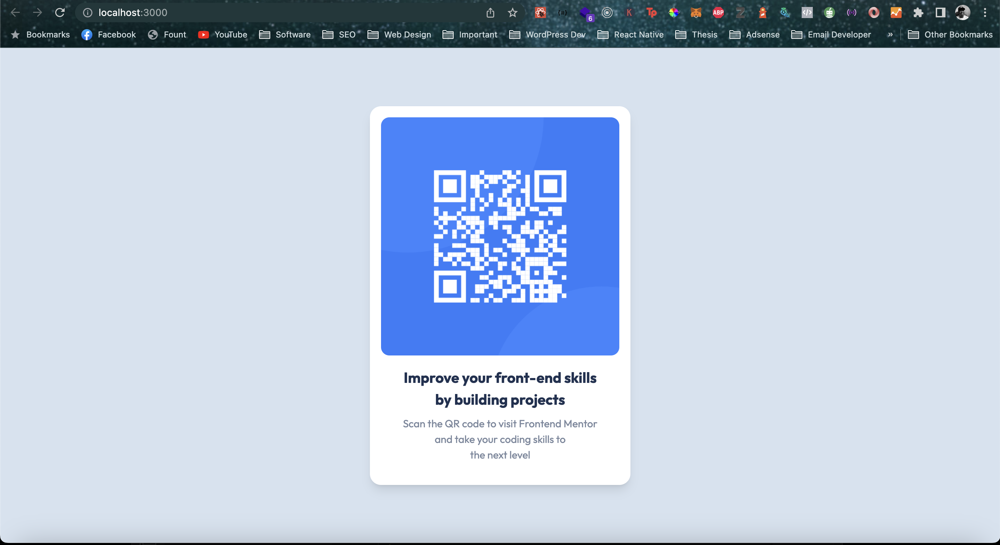

# Frontend Mentor - QR code component solution

This is a solution to the [QR code component challenge on Frontend Mentor](https://www.frontendmentor.io/challenges/qr-code-component-iux_sIO_H). Frontend Mentor challenges help you improve your coding skills by building realistic projects. 

## Table of contents

- [Frontend Mentor - QR code component solution](#frontend-mentor---qr-code-component-solution)
  - [Table of contents](#table-of-contents)
  - [Overview](#overview)
    - [Screenshot](#screenshot)
    - [Links](#links)
  - [My process](#my-process)
    - [Built with](#built-with)
    - [What I learned](#what-i-learned)
    - [Continued development](#continued-development)
    - [Useful resources](#useful-resources)
  - [Author](#author)


## Overview

### Screenshot




### Links

- Solution URL: [Add solution URL here](https://grand-choux-e1c141.netlify.app/)
- Live Site URL: [Add live site URL here](https://grand-choux-e1c141.netlify.app/)

## My process

### Built with

- Semantic HTML5 markup
- Tailwind CSS
- Flexbox
- Mobile-first workflow
- [React](https://reactjs.org/) - JS library
- [Tailwind CSS](https://tailwindcss.com/) - For styles


### What I learned

I learnt 2 things in this build. Using a one off CSS value in tailwind using the square brackets. And also using h-screen to splash the specified color on the entire background. Examples below: 

```css
<p className='text-[15px]></p>
<div className='bg-background h-screen'>
```

### Continued development

I will want to continously learn how to use template customization values throughout the project. Use cases like turning screen widths from mobile to desktop.


### Useful resources

- [Tailwind Documentation](https://tailwindcss.com/docs) - This helped me for XYZ reason. I really liked this pattern and will use it going forward. The tailwind documentation is a great medium which helpled me throughout the build. I will strongly recommend it to anyone who is building using tailwind css. 


## Author

- Website - [Ridwan Kadri](https://www.ridkadri.com)
- Frontend Mentor - [@yourusername](https://www.frontendmentor.io/profile/ridkadri)
- Twitter - [@ridCuDi](https://www.twitter.com/ridCuDi)

